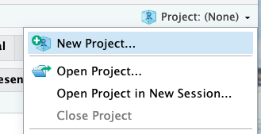
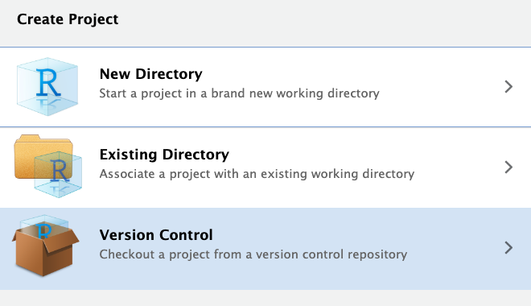
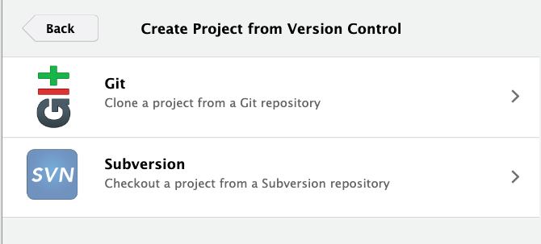
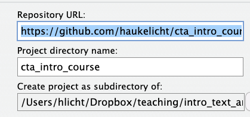

# Introduction to computational text analysis for the DIA (DA Vienna)

This Github repository accompanies the DIA course "Introduction to computational text analysis" taught by Hauke Licht (hauke.licht@uibk.ac.at, University of Innsbruck) at the DA Vienna.

Participants must **complete the computer setup** described below during the first course block.


# Computer setup

## R setup

### 1. Install/update R and RStudio

Participants must have running installations of the **_R_** programming languages and the **_RStudio_** integrated development environment (IDE) at the beginning of the course.

- Please follow the instructions at https://posit.co/download/rstudio-desktop to install R and RStudio.
- Verify that you have at least R 4.2.0 by running the following line in R(studio):
  ```R
  R.version[["version.string"]]
  ```
- Verify that you have at least RStudio version 2023.12 by running the following line in R(studio):
  ```R
  rstudioapi::versionInfo()$version
  ```
- To keep course materials up-to-date on your computer, you also require a **Git** installation (see [here](https://rfortherestofus.com/2021/02/how-to-use-git-github-with-r) and [here](https://happygitwithr.com/rstudio-git-github.html)). A user-friendly option is using the [**_Github Desktop app_**](https://docs.github.com/en/desktop/installing-and-authenticating-to-github-desktop/installing-github-desktop) For alternatives, see [here](https://happygitwithr.com/install-git#install-git), incl. installation instructions. _Note @ Windows users_: I recommend using Github Desktop or [_Git for Windwows_](https://gitforwindows.org/).

Please contact the instructor (hauke.licht@uibk.ac.at) should you encounter issues or errors during setup.

### 2. Clone this repository from Github to your local computer


| Step | Description | Screenshot  |
| ----:|:----------- |:--:|
| 1. | Open the RStudio App on your computer | |
| 2. | Begin creating a new project |   |
| 3. | Choose creating from "Version control" option |   |
| 4. | Choose "Git" option |   |
| 5. | Insert `https://github.com/haukelicht/dia_cta_course.git` as "Repository URL", use `dia_cta_course` as "Project directory name", and choose a location on your computer |   |

### 3. setup `renv` and install the required packages

1. Open the R project in Rstudio (if not already open)
2. Open the file [setup.R](./setup.R)
3. Run the R script by clicking "Run" or pressing ⌘ + ⏎ (macOS) or Ctrl+Enter (Windows)

**_Note:_** Installing all the packages that we will use throughout the course may take a while, depending on your internet connection and computer speed. Please be patient.

## Python setup (_optional_)

I recommend to use use [*Anaconda*](https://www.anaconda.com/) or another package manager to setup Python for this course.

You'll need to take three steps:

1. install Anaconda and verify your Anaconda installation (python and conda should be ready to go)
2. create a new conda environment
3. install required packages in your conda environment

Let's take these steps in turn!

**_Note:_** If you encounter any issues, email me (hauke.licht@uibk.ac.at) or [post an issue](https://github.com/haukelicht/advanced_text_analysis/issues).

### 1. Install Anaconda

We recommend manual installation.
For this, you need to download the installer for your operation system (Windows or macOS), and then run the installer to configure Anaconda for use on your computer 

#### Windows

Download the Installer from https://www.anaconda.com/download/success#windows

With the installer downloaded, the following two links provide detailed follow-up instructions: 

- https://www.datacamp.com/tutorial/installing-anaconda-windows
- https://www.anaconda.com/docs/getting-started/anaconda/install#windows-installation

*Notes:*

1. The screenshots in the first link are a little outdated, but the instructions remain valid.
2. In step six described in the first link, please opt for the "Alternative Aproach" (i.e., automatically add Anaconda to your PATH variable at installation time) 

#### MacOS/Linux

Download the Installer from https://www.anaconda.com/download/success#mac or 
follow the instructions in ['setup_macos.md'](./setup_macos.md)

*Notes:* 

- If your computer has Apple silicon (i.e., and M1/M2/... chip), choose "64-bit (Apple silicon) Graphical Installer". Otherwise, choose ""64-bit (Intel chip) Graphical Installer""
- If you *don't know* whether your Mac has Apple silicon, follow these instructions to find out: https://www.howtogeek.com/706226/how-to-check-if-your-mac-is-using-an-intel-or-apple-silicon-processor

With the installer downloaded, the following two links provide detailed follow-up instructions: 

- https://www.datacamp.com/tutorial/installing-anaconda-mac-os-x
- https://www.anaconda.com/docs/getting-started/anaconda/install#macos-linux-installation

**_Important note:_** When asked to select the destination of the installation (step 4 in the second link), please choose "Install for me only" (e.g., use your Application folder)

### 2. Verify your Anaconda installation

follow the instructions here: 

- Windows: https://www.anaconda.com/docs/getting-started/anaconda/install#windows-installation:how-do-i-verify-my-installers-integrity
- macOS/Linux: https://www.anaconda.com/docs/getting-started/anaconda/install#macos-linux-installation:how-do-i-verify-my-installers-integrity

### 3. Create a new conda environment

#### Using the Anaconda Navigator app

The  Anaconda Navigator app should have open when you finished your Anaconda installation.
If not, open it from your applications (see [here](https://docs.anaconda.com/free/navigator/getting-started/#navigator-starting-navigator) for instructions).

Then, follow the instructions [here](https://docs.anaconda.com/free/navigator/tutorials/create-python35-environment/),  taking into account the following notes:

- in step 4, use 'dia_cta_course' as environment name
- in step 5, use the python version that starts with '3.11' (or higher)
- in step 7, choose "open Terminal" and go to the next step of our setup process 

#### Using the command line

- on Windows: Open the Anaconda Prompt
- on macOS: Open the Terminal app

To create a new conda environment, run the following lines:

**_Note:_** If you are a Mac user and your MacBook has an M1, M2, or M3 chip, put `CONDA_SUBDIR=osx-arm64` in front of `conda create` when running the code below

```shell
conda create --name dia_cta_course python=3.11 pip

conda activate dia_cta_course
```


- The part after `--name` is the name of the environment. So our new environment is called 'dia_cta_course'
- `python=3.11` specifies that we want to use python version 3.12 in this environment
- `pip` specifies that we want to pre-install pip

### 4. Install required pacakages

It's best to first check if there would be any version conflicts.

So first, run the following command in the Anaconda Prompt (Windows)/Terminal (macOS):

```shell
pip install --dry-run --ignore-installed -r https://raw.githubusercontent.com/haukelicht/dia_cta_course/main/requirements.txt
```

Next, install the packages by running the following command in the Anaconda Prompt (Windows)/Terminal (macOS):

```shell
# install all required packages in the correct versions
pip install -r https://raw.githubusercontent.com/haukelicht/dia_cta_course/main/requirements.txt
```
